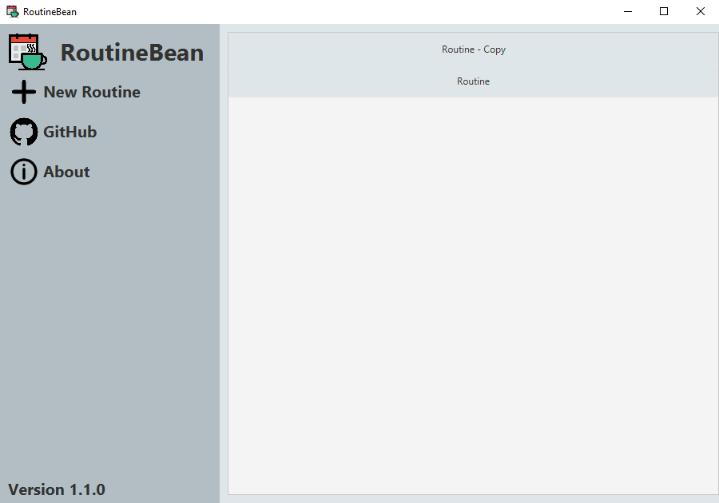

<!--Version-1.0.0-->

# RoutineBean

<p align="center">
  <a href="https://github.com/jrt345/RoutineBean/releases/latest"></a>
  <a href="https://opensource.org/licenses/GPL-3.0"></a>
</p>

RoutineBean is a routine building desktop app that can easily create a weekly routine. It features a grid UI with each cell representing a specific hour and day of the week. Multiple cells can easily be modified using the quick add feature, saving time. 

## Getting Started

### Prerequisites

* A recent version of [JDK 17 or later](https://www.oracle.com/java/technologies/downloads/) for building 'master' branch
* A recent version of [SceneBuilder 17.0.0 or later](https://gluonhq.com/products/scene-builder/) to read .fxml files

### Installation

To clone the current 'master' branch of RoutineBean, run the following command inside your desired directory:

```
git clone https://github.com/jrt345/RoutineBean.git
```

## Built With


* [JavaFX](https://openjfx.io/) - GUI Library
* [JUnit 5](https://junit.org/junit5/) - Unit Testing
* [Maven](https://maven.apache.org/) - Dependency Management
* [Apache Commons IO](https://commons.apache.org/proper/commons-io/) - IO Utilities Library
* [Gson](https://github.com/google/gson) - Json Serialization/Deserialization Library
* [SceneBuilder](https://gluonhq.com/products/scene-builder/) - Used to create and design JavaFX UIs

## Versioning

RoutineBean uses [SemVer](http://semver.org/) for versioning. For the versions available, see the [tags on this repository](https://github.com/jrt345/RoutineBean/tags).

## License

This project is licensed under the GNU General Public License v3.0 - see the [LICENSE](LICENSE) file for details

## Screenshots

### Main Screen:


### Routine Screen:


